<div align="center">

# 🐳 Docker & Containers — Visual Guide

**A visual, hands-on guide to understanding Docker from first principles.**
Built for home-labbers, self-hosters, and anyone who wants to truly *get* containers.

[](https://www.docker.com/)
[](LICENSE)
[](https://github.com/Shekhar-Kaviraj-Tiruwa-1)

</div>

---

## 📚 Table of Contents

- [What is Docker?](#-what-is-docker)
- [How Docker Works](#-how-docker-works)
- [Container Layer Structure](#-container-layer-structure)
- [Docker Command Reference](#-docker-command-reference)
- [Docker vs Virtual Machine](#-docker-vs-virtual-machine)
- [Home Lab Setup](#-home-lab-setup)
- [Interactive HTML Version](#-interactive-html-version)

---

## 📦 What is Docker?

> Docker lets you package an app and everything it needs into a self-contained box called a **container**. It runs the same way everywhere — your Mac, your Raspberry Pi, a cloud server.

### The Core Analogies

<table>
<tr>
<td width="50%">

**📦 Shipping Container**

Before shipping containers, cargo was packed differently onto every ship. Docker containers work the same way — **pack your app once, ship it anywhere**. The ship (your computer) doesn't care what's inside.

</td>
<td width="50%">

**🍱 Packed Lunchbox**

A container is like a lunchbox — it has **everything the app needs** packed inside: the food (code), the utensils (libraries), and the napkin (config). Open any lunchbox and it works the same.

</td>
</tr>
<tr>
<td>

**🏠 Without Docker — "Works on My Machine"**

App works on your laptop. Fails on the server. Fails on your Raspberry Pi. Everyone has different versions of Python, Node, libraries. Docker **eliminates this** — the container includes everything.

</td>
<td>

**🧱 Image vs Container**

| Term | What it is |
|------|-----------|
| **Image** | The recipe (read-only blueprint) |
| **Container** | The meal made from that recipe (running instance) |

One image can spawn many containers simultaneously.

</td>
</tr>
</table>

---

### 🖥️ Your Mac Mini Running 3 Containers Simultaneously

```
┌─────────────────────────────────────────────────────────────────┐
│  HOST MACHINE: Mac Mini M4 · macOS                              │
│  Docker Engine → manages all containers below                   │
│                                                                  │
│  ┌───────────────┐  ┌───────────────┐  ┌───────────────────┐   │
│  │  Container 1  │  │  Container 2  │  │    Container 3    │   │
│  │               │  │               │  │                   │   │
│  │  🕳️ Pi-hole   │  │  ☁️ Nextcloud │  │  🔐 Vaultwarden  │   │
│  │               │  │               │  │                   │   │
│  │  ● running    │  │  ● running    │  │  ● running        │   │
│  │  Port: 53     │  │  Port: 8080   │  │  Port: 8888       │   │
│  │  Port: 80     │  │  Vol: /data   │  │  Vol: /vw-data    │   │
│  │               │  │               │  │                   │   │
│  │  ▓▓▓▓▓▓ app  │  │  ▓▓▓▓▓▓ app  │  │  ▓▓▓▓▓▓ app       │   │
│  │  ████████deps│  │  ████████deps│  │  ████████deps      │   │
│  │  ██████████  │  │  ██████████  │  │  ██████████        │   │
│  │  base layer  │  │  base layer  │  │  base layer        │   │
│  └───────────────┘  └───────────────┘  └───────────────────┘   │
└─────────────────────────────────────────────────────────────────┘
```

> **Key insight:** All three containers share the same Mac Mini hardware and macOS kernel — but are completely isolated from each other. Pi-hole can't see Nextcloud's files. Each thinks it's running alone.

---

## ⚙️ How Docker Works

From writing a Dockerfile to a running container — the complete journey your app takes:


### Step-by-Step

| Step | Command | What Happens |
|------|---------|-------------|
| 1. Write | `Dockerfile` | You describe the environment in plain text |
| 2. Build | `docker build -t myapp .` | Docker reads your Dockerfile and creates an image |
| 3. Store | `docker images` | Image lives on your machine (or Docker Hub) |
| 4. Run | `docker run myapp` | Docker creates a live container from the image |

---

## 🗂️ Container Layer Structure

Every Docker image is built in **stacked layers** — like a cake. Each layer only stores what changed, making images small and fast.

```
  ┌──────────────────────────────────────────┐
  │  🖥️  YOUR APP CODE              READ/WRITE │  ← Your Python script, Node server, etc.
  │      The actual application               │
  ├──────────────────────────────────────────┤
  │  📚  DEPENDENCIES & LIBRARIES  READ ONLY  │  ← npm packages, pip libs, apt tools
  │      Exact versions your app needs        │
  ├──────────────────────────────────────────┤
  │  ⚙️  RUNTIME ENVIRONMENT        READ ONLY  │  ← Node 20, Python 3.11, Java 17
  │      The language runtime                 │
  ├──────────────────────────────────────────┤
  │  🐧  BASE OS LAYER              READ ONLY  │  ← Minimal Linux (Alpine, Ubuntu, Debian)
  │      Just the essentials, no desktop GUI  │
  └──────────────────────────────────────────┘
```

**Why layers matter:**
- Multiple images can **share base layers** — saves disk space
- Only changed layers get rebuilt — makes `docker build` fast
- Layers are **content-addressed** — same content = same layer ID

> ⚠️ **Important:** Containers are ephemeral by default — delete a container and all data inside it is gone. To persist data (like Pi-hole's blocklists), use **volumes** — a folder on your host machine mounted into the container.

---

## 🚀 Docker Command Reference

### 📦 Images

```bash
# Download an image from Docker Hub
docker pull nginx

# List all downloaded images on your machine
docker images

# Delete a downloaded image
docker rmi nginx

# Build an image from a Dockerfile in current folder
docker build -t myapp .
```

### 🚀 Running Containers

```bash
# Run a container (foreground, blocking)
docker run nginx

# -d = detached, runs in background
docker run -d nginx

# Map host port 8080 → container port 80
docker run -p 8080:80 nginx

# Give the container a friendly name
docker run --name mybox nginx

# Combine flags — detached, named, with port mapping
docker run -d --name mybox -p 8080:80 nginx
```

### 🔍 Inspecting Containers

```bash
# List only running containers
docker ps

# List ALL containers including stopped ones
docker ps -a

# Show a container's output / logs
docker logs mybox

# Follow logs live (like tail -f)
docker logs -f mybox
```

### 🛑 Stopping & Cleaning Up

```bash
# Gracefully stop a running container
docker stop mybox

# Start a stopped container again
docker start mybox

# Delete a stopped container
docker rm mybox

# Remove all stopped containers + unused images
docker system prune
```

### 🔧 Inside a Container

```bash
# Open a terminal shell inside a running container
docker exec -it mybox bash

# Run a one-off command inside a container
docker exec mybox ls /etc

# Copy a file from host into a container
docker cp file.txt mybox:/app/

# Show full details (IPs, mounts, config) as JSON
docker inspect mybox
```

### 🗃️ Docker Compose

```bash
# Start all services in docker-compose.yml
docker-compose up -d

# Stop and remove all compose containers
docker-compose down

# Follow live logs for all services
docker-compose logs -f

# Status of all compose services
docker-compose ps
```

> ✅ **Home lab tip:** For services you want running 24/7 (Pi-hole, Nextcloud), always add `--restart unless-stopped` to your docker run command. This makes the container restart automatically if Docker restarts or your machine reboots.

---

## 🆚 Docker vs Virtual Machine

Both Docker and VMs isolate software — but they work very differently.

### Architecture Comparison

```
VIRTUAL MACHINE                          DOCKER CONTAINER
─────────────────────────────            ─────────────────────────────
┌──────────┐ ┌──────────┐               ┌──────────┐ ┌──────────┐
│  App A   │ │  App B   │               │  App A   │ │  App B   │
├──────────┤ ├──────────┤               ├──────────┤ ├──────────┤
│  Libs    │ │  Libs    │               │  Libs    │ │  Libs    │
├──────────┤ ├──────────┤               ├──────────┤ ├──────────┤
│  Ubuntu  │ │  Windows │               │Container │ │Container │
│  (Guest) │ │  (Guest) │               │ Runtime  │ │ Runtime  │
├──────────┴─┴──────────┤               └──────────┴─┴──────────┘
│     Hypervisor        │               ┌────────────────────────┐
├───────────────────────┤               │   Docker Engine        │
│     Host OS           │               ├────────────────────────┤
├───────────────────────┤               │     Host OS            │
│     Hardware          │               ├────────────────────────┤
└───────────────────────┘               │     Hardware           │
                                        └────────────────────────┘
 Each VM has its OWN full OS             Containers SHARE the host OS kernel
 → Heavy (GBs), slow to start           → Lightweight (MBs), starts instantly
```

### Feature Comparison

| Feature | 🐳 Docker Container | 🖥️ Virtual Machine |
|---------|--------------------|--------------------|
| **Startup time** | ✅ Milliseconds | ❌ 30–60 seconds |
| **RAM usage** | ✅ Only what app needs | ❌ Full OS overhead (~1–2 GB) |
| **Disk space** | ✅ Megabytes (shared layers) | ❌ Gigabytes per VM |
| **Isolation** | Process-level (strong) | ✅ Full kernel isolation (strongest) |
| **Portability** | ✅ Run anywhere Docker installed | Tied to hypervisor format |
| **Multiple instances** | ✅ Easy — 10+ on one machine | ❌ Limited by RAM/CPU overhead |
| **Best for** | ✅ Apps, services, microservices | Full OS testing, different OSes |
| **Your use case** | ✅ Pi-hole, Nextcloud, Vaultwarden | Running Ubuntu on your Mac Mini |

---

## 🏠 Home Lab Setup

```mermaid
graph TD
    A[🍎 Mac Mini M4\nhardware] --> B[UTM Hypervisor]
    B --> C[🐧 Ubuntu VM\nyour Linux foundation]
    C --> D[🐳 Docker Engine]
    D --> E[🕳️ Pi-hole\nDNS ad-blocker]
    D --> F[☁️ Nextcloud\nself-hosted cloud]
    D --> G[🔐 Vaultwarden\npassword manager]
    D --> H[📺 Plex / Jellyfin\nmedia server]

    style A fill:#1a1a2e,stroke:#e8ecf4,color:#e8ecf4
    style B fill:#2d1f4e,stroke:#9b7ef8,color:#e8ecf4
    style C fill:#1a2a1a,stroke:#26c26b,color:#e8ecf4
    style D fill:#1a3a5c,stroke:#2496ed,color:#e8ecf4
    style E fill:#1a1a2e,stroke:#f5a623,color:#e8ecf4
    style F fill:#1a1a2e,stroke:#f5a623,color:#e8ecf4
    style G fill:#1a1a2e,stroke:#f5a623,color:#e8ecf4
    style H fill:#1a1a2e,stroke:#f5a623,color:#e8ecf4
```



**Your home lab strategy:** Use UTM (VM) to run Ubuntu on your Mac Mini as the foundation. Then run all your home lab services **inside Docker containers within that Ubuntu VM**. You get the best of both — a proper Linux environment from the VM, and lightweight, easy-to-manage services from Docker.

### Real Example — Running Pi-hole in Docker

```bash
docker run -d --name pihole \
  -p 53:53/tcp -p 53:53/udp -p 80:80 \
  -e TZ="America/Toronto" \
  -v pihole_data:/etc/pihole \
  --restart unless-stopped \
  pihole/pihole:latest
```

This one command downloads and starts Pi-hole — no manual installation needed. The `-v` flag saves its data permanently so it survives container restarts.

### Example `docker-compose.yml` for Multiple Services

```yaml
version: "3.8"

services:
  pihole:
    image: pihole/pihole:latest
    container_name: pihole
    ports:
      - "53:53/tcp"
      - "53:53/udp"
      - "80:80"
    environment:
      TZ: "America/Toronto"
    volumes:
      - pihole_data:/etc/pihole
    restart: unless-stopped

  nextcloud:
    image: nextcloud:latest
    container_name: nextcloud
    ports:
      - "8080:80"
    volumes:
      - nextcloud_data:/var/www/html
    restart: unless-stopped

  vaultwarden:
    image: vaultwarden/server:latest
    container_name: vaultwarden
    ports:
      - "8888:80"
    volumes:
      - vaultwarden_data:/data
    restart: unless-stopped

volumes:
  pihole_data:
  nextcloud_data:
  vaultwarden_data:
```

Start everything with one command:

```bash
docker-compose up -d
```

---

## 🌐 Interactive HTML Version

This repo includes an **interactive HTML version** (`docker.html`) with:

- Clickable tabs for each concept
- Simulated terminal output for common Docker commands
- Animated container layer diagrams
- Live-looking container status display

To use it, simply open `docker.html` in any browser — no server needed.

---

## 📖 Quick Reference Card

<details>
<summary><strong>Click to expand — Essential Docker commands cheat sheet</strong></summary>

```
IMAGES                           CONTAINERS
──────────────────────────────   ──────────────────────────────
docker pull <image>              docker run <image>
docker images                    docker run -d <image>         (background)
docker rmi <image>               docker run -p host:cont img   (port map)
docker build -t name .           docker run --name box img     (named)
                                 docker ps                     (running)
                                 docker ps -a                  (all)
                                 docker stop <name>
                                 docker start <name>
                                 docker rm <name>

INSIDE CONTAINERS                COMPOSE
──────────────────────────────   ──────────────────────────────
docker exec -it box bash         docker-compose up -d
docker exec box <cmd>            docker-compose down
docker logs box                  docker-compose logs -f
docker logs -f box               docker-compose ps
docker inspect box
docker cp file.txt box:/path/

CLEANUP
──────────────────────────────
docker system prune              (remove stopped containers + unused images)
docker image prune               (remove only unused images)
docker volume prune              (remove unused volumes)
```

</details>

---

<div align="center">

Made to understand Docker from first principles · Built for home labs and self-hosters

</div>
